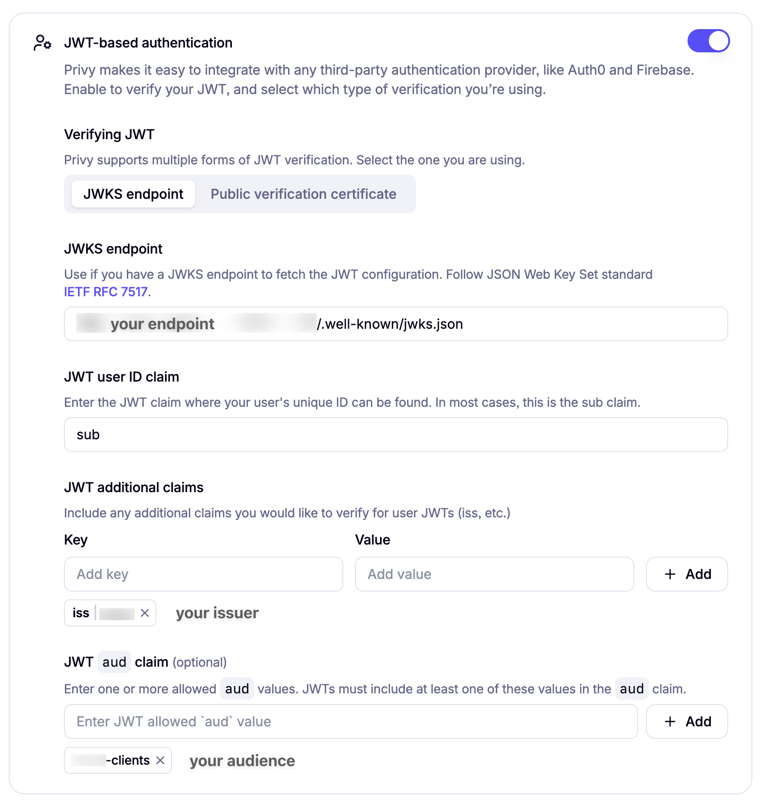

# How to Privy with Custom Authentication

This repository demonstrates how to integrate Privy.io with custom authentication using JWKS (JSON Web Key Set) on the server side. Privy is a user onboarding and wallet infrastructure platform that enables developers to build better products on crypto rails by embedding asset control directly into applications.

If you're unfamiliar with JWKS, refer to the comprehensive guide at [How to JWKS](https://github.com/vicentesan/how-to-jwks) before proceeding.

> [!NOTE]
> This guide focuses exclusively on server-side implementation. For client-side integration (React, React Native, etc.), please refer to [Privy's client SDK documentation](https://docs.privy.io/welcome)


## About Privy

Privy provides authentication and embedded wallet infrastructure that supports multiple platforms including React, React Native, Swift (iOS), Android, Flutter, Unity, and server-side SDKs for Node.js, Python, and Java. The platform offers:

- Multiple authentication methods including email, SMS, social login, passkeys, and custom JWT-based authentication
- Self-custodial embedded wallets for EVM, Solana, Stellar, Tron and other blockchain networks. For more details check the [Chain support](https://docs.privy.io/transaction-management/chain-support)
- Multi-factor authentication support
- Time-bound authorization keys for cryptographically-enforced user custody

## Custom Authentication with JWKS

Privy integrates with any asymmetric JWT-based authentication system through JWKS verification. This integration enables your existing authentication infrastructure to work seamlessly with Privy's wallet and user management features.

### Why this matters now?

With the growth of libraries like [better-auth](https://github.com/better-auth), [lucia-auth](https://lucia-auth.com), and [authjs](https://authjs.dev), developers are increasingly moving away from vendor lock-in authentication services and implementing their own authentication systems. This shift represents a fundamental change in how modern applications handle user identity and security. This guide works not only with the mentioned libraries but with any service that provides a JWKS endpoint.

### Authentication Flow

The custom authentication process follows this pattern:

1. Your application authenticates users using your existing JWT-based system
2. Privy verifies the JWT against your JWKS endpoint
3. Upon successful verification, Privy issues time-bound authorization keys
4. Users can access their embedded wallets and perform crypto operations

### JWKS Integration Requirements

Your authentication system must provide:

- A publicly accessible JWKS endpoint
- JWT tokens signed with ES256 or RS256 algorithms
- Proper token claims including issuer, audience, and expiration
- HTTPS endpoint for security

### Privy Dashboard Configuration

To enable custom JWT-based authentication in your Privy application:

1. Navigate to **User Management > Authentication** in your Privy dashboard
2. Request access to JWT-based authentication (this feature requires approval)
3. Once approved, configure your JWKS endpoint as shown below:



### Platform Support

This integration approach works across all Privy-supported platforms:

- Web applications (React)
- Mobile applications (React Native, Swift, Android, Flutter)
- Desktop applications (Unity)
- Server-side implementations (Node.js, Python, Java)
- Direct REST API integration

## Getting Started

### Installation

```bash
bun add @privy-io/server-auth
```

### Core Functions

#### `createPrivyWallet()`

```ts
export async function createPrivyWallet(userId: string) {
  const privyUser = await privy.importUser({
    linkedAccounts: [
      {
        type: 'custom_auth', // here you're telling Privy that you are going to use your OWN auth system to authenticate with this user
        customUserId: userId
      }
    ]
  })

  return await privy.walletApi.createWallet({
    chainType: 'ethereum', // here you can select the desired chain
    owner: { userId: privyUser.id }
  });
}
```

#### `signMessage()`

```ts
export async function signMessage({
  message,
  userJwt,
  walletId
}: {
  message: string,
  userJwt: string,
  walletId: string
}) {
  const { authorizationKey } = await privy.walletApi.generateUserSigner({
    userJwt
  });

  privy.walletApi.updateAuthorizationKey(authorizationKey);

  return await privy.walletApi.ethereum.signMessage({
    walletId,
    message,
  });
}
```

#### `signTransaction()`

```ts
export async function signTransaction({
  transaction,
  userJwt,
  walletId
}: {
  transaction: EthereumBaseTransactionInputType,
  userJwt: string,
  walletId: string
}) {
  const { authorizationKey } = await privy.walletApi.generateUserSigner({
    userJwt
  });

  privy.walletApi.updateAuthorizationKey(authorizationKey);

  return await privy.walletApi.ethereum.signTransaction({
    walletId,
    transaction, 
  });
}
```

Feel free to explore, contribute, and adapt this implementation to your specific needs. This is just the foundation—build something amazing with it!
